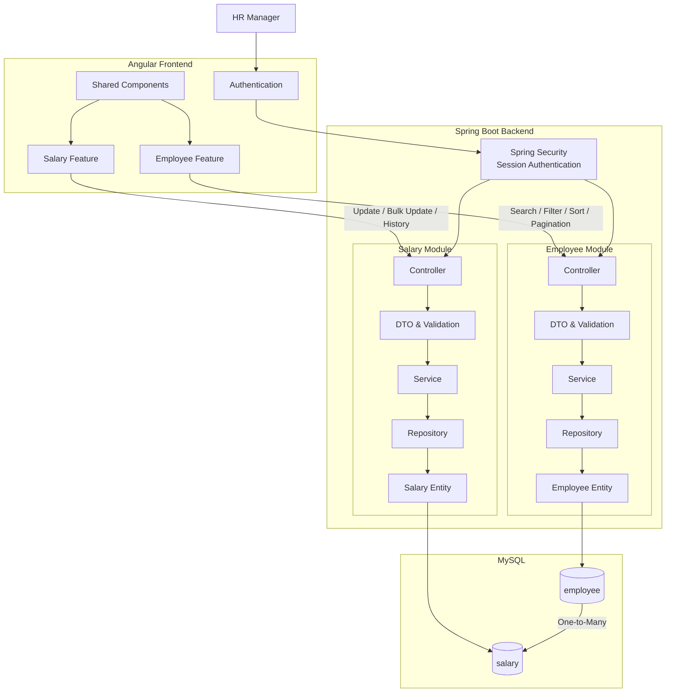

# **Architecture**

## **1. Project Structure**

The application will use a **feature-based structure** for both frontend and backend.

### **1.1. Frontend Structure**

```text
frontend/
└── src/app/
    ├── core/
    │   ├── auth/
    │   ├── guards/
    │   └── interceptors/
    │
    ├── features/
    │   ├── employee/
    │   │   ├── components/
    │   │   ├── models/
    │   │   └── services/
    │   │
    │   └── salary/
    │       ├── components/
    │       ├── models/
    │       └── services/
    │
    ├── shared/
    │   └── components/
    │
    ├── app.routes.ts
    └── app.config.ts
```

### **1.2. Backend Structure**

```text
backend/
└── src/main/java/.../
    ├── employee/
    │   ├── EmployeeController.java
    │   ├── EmployeeService.java
    │   ├── EmployeeRepository.java
    │   ├── EmployeeEntity.java
    │   └── dto/
    │
    ├── salary/
    │   ├── SalaryController.java
    │   ├── SalaryService.java
    │   ├── SalaryRepository.java
    │   ├── SalaryEntity.java
    │   └── dto/
    │
    ├── auth/
    │   └── SecurityConfig.java
    │
    └── common/
        └── exception/
```

## **2. System Architecture**



## **3. Application Flow**

* **Angular Authentication** handles the HR login flow and protected frontend routes.
* **Employee Feature** handles the employee salary table, search, filtering, sorting, and pagination.
* **Salary Feature** handles salary updates, bulk updates, and salary history.
* **Spring Security** handles session-based authentication and protects backend APIs.
* **Employee Module** handles employee-related backend operations.
* **Salary Module** handles salary-related backend operations.
* **Employee** and **Salary** have a **One-to-Many relationship** in MySQL.