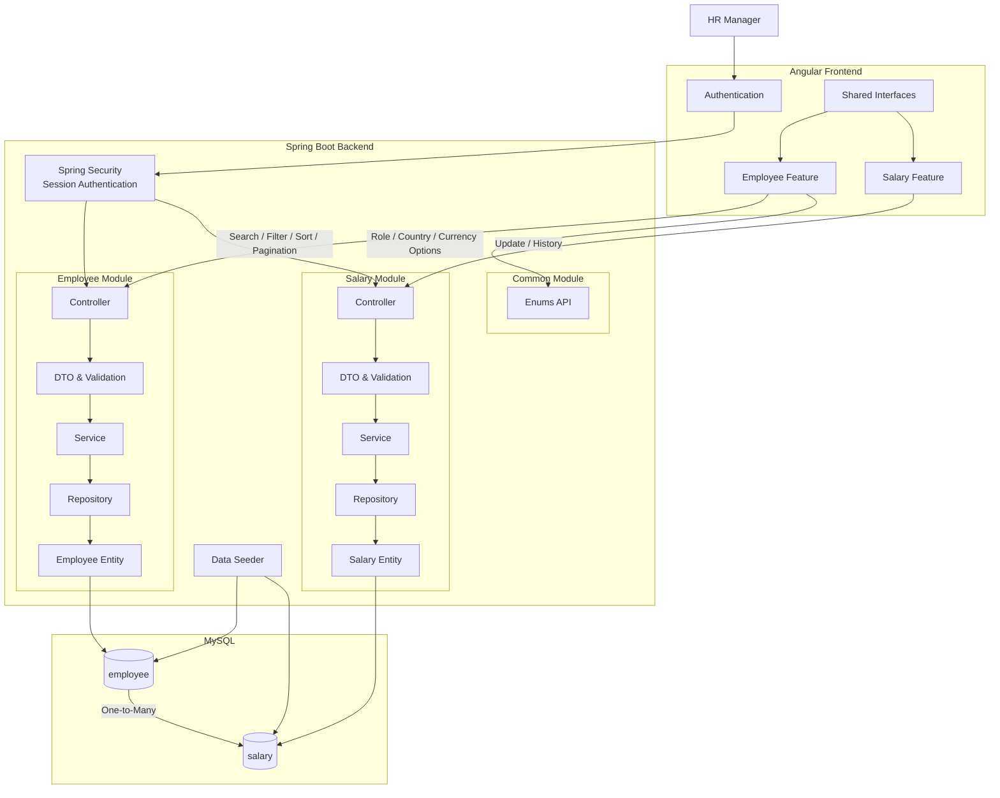

# **Architecture**

## **1. Project Structure**

The application uses a **feature-based structure** for both frontend and backend.

### **1.1. Frontend Structure**

```text
frontend/
`-- src/app/
    |-- core/
    |   |-- auth/
    |   |   |-- guards/
    |   |   |-- pages/
    |   |   `-- services/
    |   `-- interceptors/
    |
    |-- features/
    |   |-- employee/
    |   |   |-- components/
    |   |   |-- pages/
    |   |   `-- services/
    |   |
    |   `-- salary/
    |       |-- components/
    |       `-- services/
    |
    |-- shared/
    |   `-- interfaces/
    |
    |-- app.routes.ts
    `-- app.config.ts
```

### **1.2. Backend Structure**

```text
backend/
`-- src/main/java/com/acme/salarymanagement/
    |-- auth/
    |   |-- AuthController.java
    |   |-- AuthService.java
    |   |-- SecurityConfig.java
    |   `-- dto/
    |
    |-- common/
    |   |-- EnumController.java
    |   |-- dto/
    |   `-- enums/
    |
    |-- employee/
    |   |-- EmployeeController.java
    |   |-- EmployeeService.java
    |   |-- EmployeeRepository.java
    |   |-- EmployeeEntity.java
    |   `-- dto/
    |
    |-- salary/
    |   |-- SalaryController.java
    |   |-- SalaryService.java
    |   |-- SalaryRepository.java
    |   |-- SalaryEntity.java
    |   `-- dto/
    |
    `-- seed/
        `-- DataSeeder.java
```

## **2. System Architecture**



## **3. Application Flow**

* **Angular Authentication** handles the HR login flow and protected frontend routes.
* **Employee Feature** handles the employee salary table, search, filtering, sorting, and pagination.
* **Salary Feature** handles individual salary updates and salary history.
* **Shared Interfaces** define frontend response shapes used across features.
* **Spring Security** handles session-based authentication and protects backend APIs.
* **Employee Module** handles employee-related backend operations.
* **Salary Module** handles salary-related backend operations.
* **Common Module** exposes role, country, and currency option data.
* **Data Seeder** creates employee and salary data during startup when employee data is empty.
* **Employee** and **Salary** have a **One-to-Many relationship** in MySQL.